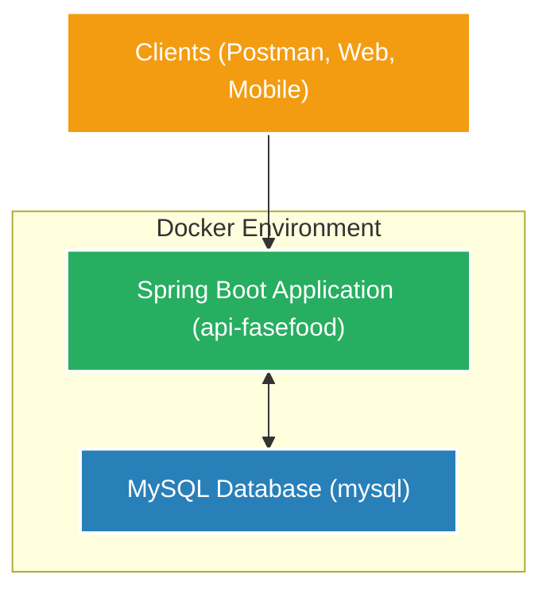

# Projeto: Fase Food - API para Gestão de Usuários para Restaurantes Fast Food

## 1. Introdução

### Descrição do problema
O Fase Food é uma solução de gestão para restaurantes de fast food, visando automatizar o processo de pedidos e organizar o fluxo de preparação e entrega. O sistema gerencia usuários (clientes e administradores) com objetivo de facilitar o processo de pedidos e reduzir filas.

### Objetivo do projeto
Desenvolver um backend robusto utilizando Spring Boot para gerenciar usuários, incluindo operações CRUD completas e validação de login. O sistema será containerizado com Docker e utilizará um banco de dados MySQL para persistência de dados, focando no gerenciamento de usuários.

## 2. Arquitetura do Sistema

### Descrição da Arquitetura
O projeto Fase Food segue uma arquitetura em camadas, similar ao padrão MVC adaptado para APIs REST:

- **Controller Layer**: Responsável por receber as requisições HTTP, validar os inputs e direcionar para os serviços apropriados.
- **Service Layer**: Contém a lógica de negócio, orquestrando as operações e interagindo com os repositórios.
- **Repository Layer**: Responsável pela persistência e recuperação de dados do banco MySQL.
- **Model/Entity Layer**: Representa as entidades de domínio (ex: Usuário, Endereço) e suas relações.
- **DTO Layer**: Objetos de transferência de dados que isolam a API externa das entidades internas.

A aplicação está containerizada com Docker, utilizando um container para a aplicação Spring Boot e outro para o banco de dados MySQL. A comunicação é estabelecida via Docker Compose, garantindo isolamento e facilidade de implantação.

### Diagrama da Arquitetura



## 3. Descrição dos Endpoints da API

### Tabela de Endpoints

| Endpoint                      | Método | Descrição                                      |
|-------------------------------|--------|------------------------------------------------|
| `/api/v1/users`                 | GET    | Recupera todos os usuários (paginado)            |
| `/api/v1/users/{id}`            | GET    | Recupera um usuário específico pelo ID         |
| `/api/v1/users`                 | POST   | Adiciona um novo usuário (Comum ou Administrador) |
| `/api/v1/users/{id}`            | PUT    | Atualiza dados de um usuário existente         |
| `/api/v1/auth/{id}/password`  | PATCH  | Atualiza a senha de um usuário                 |
| `/api/v1/users/{id}`            | DELETE | Remove um usuário do sistema                   |
| `/api/v1/auth/login`            | POST   | Autentica um usuário no sistema                |

### Exemplos de requisição e resposta

#### Criar usuário (POST /api/v1/users)

**Requisição:**
```json
{
    "nome": "Leonardo",
    "email": "leonardomattioli00@gmail.com",
    "login": "leomattioli",
    "senha": "123456",
    "tipoUsuario": "USUARIO_COMUM",
    "endereco": {
        "logradouro": "Av Winston Churchill",
        "numero": "520",
        "cep": "09614000",
        "complemento": "bloco c ap 11",
        "bairro": "Rudge Ramos",
        "cidade": "São Bernardo do Campo",
        "uf": "SP"
    }
}
```

**Resposta Esperada (Exemplo 201 Created):**
```json
{
    "id": 1, // Ou o ID gerado
    "nome": "Leonardo",
    "email": "leonardomattioli00@gmail.com",
    "login": "leomattioli",
    "tipoUsuario": "USUARIO_COMUM"
}
```

#### Login (POST /api/v1/auth/login)

**Requisição:**
```json
{
    "login": "leomattioli",
    "senha": "123456"
}
```

**Resposta Esperada (Exemplo 200 OK):**
```json
{
    "sucesso": true,
    "mensagem": "Login realizado com sucesso"
}
```

## 4. Configuração do Projeto

### Configuração do Docker Compose

O arquivo `docker-compose.yml` orquestra os serviços da aplicação:

```yaml
services:
  api-fasefood:
    build: .
    image: fase-food:1.0
    ports:
      - "8080:8080"
    networks:
      - api-network
    depends_on:
      - mysql
    environment:
      - SPRING_DATASOURCE_URL=jdbc:mysql://mysql:3306/fasefood?createDatabaseIfNotExist=true&useSSL=false&allowPublicKeyRetrieval=true
      - SPRING_DATASOURCE_USERNAME=root
      - SPRING_DATASOURCE_PASSWORD=password
    restart: on-failure

  mysql:
    image: mysql:8.0
    container_name: mysql
    command: --default-authentication-plugin=mysql_native_password --bind-address=0.0.0.0
    ports:
      - "3306:3306"
    networks:
      - api-network
    environment:
      - MYSQL_ROOT_PASSWORD=password
      - MYSQL_DATABASE=fasefood
      - MYSQL_ROOT_HOST=%
    volumes:
      - mysql-data:/var/lib/mysql

networks:
  api-network:
    driver: bridge

volumes:
  mysql-data:
```

Este arquivo define:
- Um container para a aplicação Spring Boot (`api-fasefood`) exposto na porta 8080.
- Um container para o banco de dados MySQL (`mysql`) exposto na porta 3306.
- Uma rede compartilhada (`api-network`) para comunicação entre os containers.
- Um volume persistente (`mysql-data`) para armazenar os dados do MySQL.

### Instruções para execução local

1.  **Clone o repositório:**
    ```bash
    git clone https://github.com/MSFelisberto/fasefood
    cd fasefood # ou o nome da pasta raiz do projeto
    ```

2.  **Construa e execute com Docker Compose:**
    Na raiz do projeto (onde o arquivo `docker-compose.yml` está localizado), execute:
    ```bash
    docker-compose up --build -d
    ```
    O comando `--build` garante que a imagem da aplicação seja construída (ou reconstruída se houver alterações no `Dockerfile`). O `-d` executa os containers em segundo plano.
    Aguarde alguns instantes para que o banco de dados e a aplicação sejam iniciados. O `Dockerfile` da aplicação inclui um `sleep 15` para dar tempo ao MySQL.

3.  **Acesse as interfaces:**
    *   **API**: `http://localhost:8080/api/v1`
    *   **Banco de Dados (MySQL)**: Acessível em `localhost:3306` com um cliente MySQL (ex: DBeaver, MySQL Workbench).
        *   Host: `localhost`
        *   Porta: `3306`
        *   Usuário: `root`
        *   Senha: `password`
        *   Database: `fasefood`

## 5. Qualidade do Código

### Boas Práticas Utilizadas

O projeto visa implementar boas práticas de desenvolvimento, incluindo:

1.  **Princípios SOLID** (quando aplicável nas camadas de serviço e componentes):
    *   **Responsabilidade Única (SRP)**: Classes com responsabilidades bem definidas (Controllers para API, Services para lógica, Repositories para dados).
    *   **Aberto/Fechado (OCP)**: Uso de interfaces para serviços/repositórios pode facilitar a extensão.
    *   **Inversão de Dependência (DIP)**: Spring Boot gerencia dependências, promovendo o uso de abstrações.

2.  **Validação de Dados**: Utilização de anotações de validação (ex: `@NotBlank`, `@Email`, `@Size`) nos DTOs/Entidades para garantir a integridade dos dados de entrada.
3.  **Documentação da API**: (Opcional, mas recomendado) Integração com Swagger/OpenAPI para documentação interativa dos endpoints. Se implementado, geralmente acessível em `/swagger-ui.html` ou `/v3/api-docs`.
4.  **Tratamento de Exceções**: Implementação de handlers globais de exceção para fornecer respostas de erro consistentes e significativas.
5.  **Containerização**: Uso de Docker para um ambiente de desenvolvimento e implantação consistente.

## 6. Collections para Teste

### Collection do Postman

A collection do Postman para testar a API está disponível no repositório: `fasefood - Tech Challenge.postman_collection.json`.

### Como importar e usar a collection:

1.  Abra o Postman.
2.  Clique em "Import" (geralmente no canto superior esquerdo).
3.  Faça o upload ou selecione o arquivo `fasefood - Tech Challenge.postman_collection.json`.
4.  Após a importação, você verá a collection "fasefood - Tech Challenge" no painel lateral.
5.  As requisições usarão `http://localhost:8080` como base para os endpoints.

### Descrição dos Testes Manuais

A collection contém requisições para validar todos os endpoints principais:

1.  **Adicionar Usuário**: Teste a criação de usuários comuns e administradores.
2.  **Recuperar Usuários**: Verifique a listagem de todos os usuários e a busca por ID.
3.  **Atualizar Usuário**: Modifique dados de um usuário existente.
4.  **Atualizar Senha**: Teste a funcionalidade de alteração de senha.
5.  **Fazer Login**: Verifique o processo de autenticação.
6.  **Deletar Usuário**: Teste a remoção de um usuário.
7.  **Testes de Validação**: A collection também inclui cenários para testar validações de entrada (ex: campos obrigatórios, formato de email, tamanho de senha).

## 7. Repositório do Código

### URL do Repositório

O código completo está disponível em: `https://github.com/MSFelisberto/fasefood`
