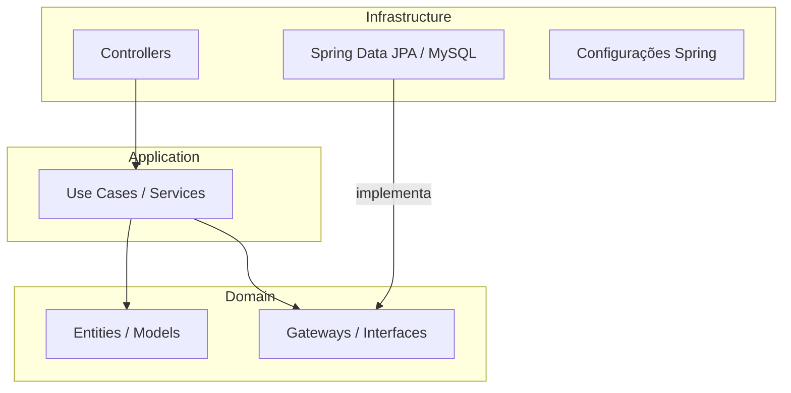

# Projeto: Fase Food - API para Gestão de Usuários para Restaurantes Fast Food

## 1. Introdução

### Descrição do problema
Um grupo de restaurantes de fast food busca uma solução de gestão unificada para otimizar suas operações e reduzir custos com sistemas individuais. A ausência de uma plataforma compartilhada dificulta a padronização e a eficiência, impactando a experiência do cliente.
### Objetivo do projeto
Desenvolver um backend robusto utilizando Spring Boot que sirva como um sistema de gestão compartilhado. Nesta segunda fase, o projeto expande para incluir o gerenciamento completo de restaurantes, cardápios e seus itens, além da diferenciação de tipos de usuário ("Cliente" e "Dono de Restaurante"). O objetivo é fornecer uma API completa para que os estabelecimentos possam gerenciar suas operações de forma autônoma.
## 2. Arquitetura do Sistema

### Arquitetura da API (Clean Architecture)
O projeto adota os princípios da Clean Architecture para garantir a separação de responsabilidades, testabilidade e escalabilidade. O código é organizado nas seguintes camadas:

- **Domain (core)**:Contém as entidades de negócio (Usuario, Restaurante, etc.) e as interfaces dos repositórios (gateways), representando o núcleo da aplicação.
- **Application (application)**: Orquestra os fluxos de negócio através dos usecases, implementando a lógica da aplicação sem depender de frameworks externos.
- **Infrastructure (infra)**: Camada mais externa, responsável pelos detalhes de implementação, como os controllers da API REST, a persistência de dados com Spring Data JPA e as configurações do Spring Boot.



A aplicação está containerizada com Docker, utilizando um container para a aplicação Spring Boot e outro para o banco de dados MySQL. A comunicação é estabelecida via Docker Compose, garantindo isolamento e facilidade de implantação.

### Diagrama do Banco de Dados

```erDiagram
    usuarios {
        BIGINT id PK
        VARCHAR nome
        VARCHAR email
        VARCHAR login
        VARCHAR senha
        BIT ativo
        BIGINT endereco_id FK
        BIGINT tipo_usuario_id FK
    }
    enderecos {
        BIGINT id PK
        VARCHAR logradouro
        VARCHAR numero
        VARCHAR cep
        VARCHAR bairro
        VARCHAR cidade
        VARCHAR uf
    }
    tipo_usuario {
        BIGINT id PK
        VARCHAR nome
    }
    restaurantes {
        BIGINT id PK
        VARCHAR nome
        VARCHAR tipo_cozinha
        TIME horario_abertura
        TIME horario_fechamento
        BIT ativo
        BIGINT endereco_id FK
        BIGINT dono_id FK
    }
    cardapios {
        BIGINT id PK
        VARCHAR nome
        VARCHAR descricao
        BIT ativo
        BIGINT restaurante_id FK
    }
    cardapio_itens {
        BIGINT id PK
        VARCHAR nome
        VARCHAR descricao
        DECIMAL preco
        BIT apenas_no_local
        VARCHAR caminho_foto
        BIT ativo
        BIGINT cardapio_id FK
    }

    usuarios ||--o{ enderecos : "possui"
    usuarios ||--o{ tipo_usuario : "é do tipo"
    restaurantes ||--o{ enderecos : "possui"
    restaurantes ||--o{ usuarios : "pertence a"
    cardapios ||--o{ restaurantes : "pertence a"
    cardapio_itens ||--o{ cardapios : "pertence a"
```

## 3. Descrição dos Endpoints da API

A API foi expandida para incluir CRUDs completos para todas as novas entidades.

### Tabela de Endpoints

| Entidade       | Endpoint                              | Método | Descrição                                         |
|----------------|---------------------------------------|--------|---------------------------------------------------|
| Usuários       | `/api/v1/users`                       | GET    | Recupera todos os usuários (paginado)             |
|                | `/api/v1/users/{id}`                  | GET    | Recupera um usuário específico pelo ID            |
|                | `/api/v1/users`                       | POST   | Adiciona um novo usuário (Comum ou Administrador) |
|                | `/api/v1/users/{id}`                  | PUT    | Atualiza dados de um usuário existente            |
|                | `/api/v1/users/{id}`                  | DELETE | Remove um usuário do sistema                      |
|                | `/api/v1/users/{id}/tipo`             | PATCH  | Altera o tipo de um usuário.                      |
| Autenticação   | `/api/v1/auth/{id}/password`          | PATCH  | Atualiza a senha de um usuário                    |
|                | `/api/v1/auth/login`                  | POST   | Autentica um usuário no sistema                   |
| Restaurantes   | `/api/v1/restaurantes`                | POST   | Cadastra um novo restaurante.                     |
|                | `/api/v1/restaurantes`                | GET    | Lista todos os restaurantes ativos.               |
|                | `/api/v1/restaurantes/{id}`           | GET    | Busca um restaurante pelo ID.                     |
|                | `/api/v1/restaurantes/{id}`           | PUT    | Atualiza os dados de um restaurante.              |
|                | `/api/v1/restaurantes/{id}`           | DELETE | Remove (desativa) um restaurante.                 |
| Cardápios      | `/api/v1/cardapios`                   | POST   | Cria um novo cardápio para um restaurante.        |
|                | `/api/v1/cardapios/restaurante/{id}`  | GET    | Lista os cardápios de um restaurante.             |
| Itens Cardápio | `/api/v1/item-cardapio`               | POST   | Cria um novo item em um cardápio.                 |
|                | `/api/v1/item-cardapio/itens/batch`   | POST   | Cria múltiplos itens em lote.                     |
|                | `/api/v1/item-cardapio/cardapio/{id}` | GET    | Lista os itens de um cardápio.                    |
|                | `/api/v1/item-cardapio/{id}`          | PUT    | Atualiza um item do cardápio.                     |
|                | `/api/v1/item-cardapio/itens/batch`   | PUT    | Atualiza múltiplos itens em lote.                 |
|                | `/api/v1/item-cardapio/{id}`          | DELETE | Remove (desativa) um item.                        |
|                | `/api/v1/item-cardapio/itens/batch`   | DELETE | Remove múltiplos itens em lote.                   |


### Exemplos de requisição e resposta

#### Criar usuário (POST /api/v1/users)

**Requisição:**
```json
{
    "nome": "Leonardo",
    "email": "leonardomattioli00@gmail.com",
    "login": "leomattioli",
    "senha": "123456",
    "tipoUsuario": "USUARIO_COMUM",
    "endereco": {
        "logradouro": "Av Winston Churchill",
        "numero": "520",
        "cep": "09614000",
        "complemento": "bloco c ap 11",
        "bairro": "Rudge Ramos",
        "cidade": "São Bernardo do Campo",
        "uf": "SP"
    }
}
```

**Resposta Esperada (Exemplo 201 Created):**
```json
{
    "id": 1,
    "nome": "Leonardo",
    "email": "leonardomattioli00@gmail.com",
    "login": "leomattioli",
    "tipoUsuario": "USUARIO_COMUM"
}
```

#### Login (POST /api/v1/auth/login)

**Requisição:**
```json
{
    "login": "leomattioli",
    "senha": "123456"
}
```

**Resposta Esperada (Exemplo 200 OK):**
```json
{
    "sucesso": true,
    "mensagem": "Login realizado com sucesso"
}
```

## 4.  Configuração e Execução

### Pré-requisitos
- Docker
- Docker Compose

### Instruções para execução
1. Clone o repositório:
```
git clone https://github.com/MSFelisberto/fasefood
cd fasefood
```

2. Construa e execute com Docker Compose:
Na raiz do projeto, execute o comando:

```
docker-compose up --build -d
```
Este comando irá construir a imagem da aplicação e iniciar os contêineres da API e do banco de dados em segundo plano.

3. Acesse as interfaces:
   * API: http://localhost:8080
   * Swagger UI (Documentação): http://localhost:8080/swagger-ui.html
   * Banco de Dados (MySQL): Acessível em localhost:3306 com as credenciais definidas no docker-compose.yml.


4. arquivo `docker-compose.yml` orquestra os serviços da aplicação:

```yaml
services:
  api-fasefood:
    build: .
    image: fase-food:1.0
    ports:
      - "8080:8080"
    networks:
      - api-network
    depends_on:
      - mysql
    environment:
      - SPRING_DATASOURCE_URL=jdbc:mysql://mysql:3306/fasefood?createDatabaseIfNotExist=true&useSSL=false&allowPublicKeyRetrieval=true
      - SPRING_DATASOURCE_USERNAME=root
      - SPRING_DATASOURCE_PASSWORD=password
    restart: on-failure

  mysql:
    image: mysql:8.0
    container_name: mysql
    command: --default-authentication-plugin=mysql_native_password --bind-address=0.0.0.0
    ports:
      - "3306:3306"
    networks:
      - api-network
    environment:
      - MYSQL_ROOT_PASSWORD=password
      - MYSQL_DATABASE=fasefood
      - MYSQL_ROOT_HOST=%
    volumes:
      - mysql-data:/var/lib/mysql

networks:
  api-network:
    driver: bridge

volumes:
  mysql-data:
```

Este arquivo define:
- Um container para a aplicação Spring Boot (`api-fasefood`) exposto na porta 8080.
- Um container para o banco de dados MySQL (`mysql`) exposto na porta 3306.
- Uma rede compartilhada (`api-network`) para comunicação entre os containers.
- Um volume persistente (`mysql-data`) para armazenar os dados do MySQL.

## 5. Qualidade do Código e Testes
O projeto adota uma estratégia de testes em duas camadas para garantir a máxima qualidade e confiabilidade.

### Testes Unitários
Os testes unitários focam em validar a lógica de negócio dentro dos usecases e domain de forma isolada. Utilizamos JUnit 5 e Mockito para mockar as dependências externas (como repositórios), garantindo que apenas a unidade de código em questão seja testada.
A cobertura de testes unitários para as camadas de negócio é de 98%.

### Testes de Integração
Para validar a colaboração entre as diferentes camadas da aplicação, o projeto conta com uma suíte de **testes de integração automatizados**.

* **Tecnologias**: Utilizamos JUnit 5, Spring Boot Test, Testcontainers e MockMvc.
* **Como funciona**: Para cada execução dos testes, o Testcontainers sobe um contêiner Docker com uma instância limpa do banco de dados MySQL. O Flyway é executado para criar o schema e popular os dados iniciais. Em seguida, o MockMvc realiza requisições HTTP reais aos endpoints da API, validando todo o fluxo, desde o Controller até a persistência no banco de dados.
* **Isolamento**: Cada classe de teste é anotada com @Transactional e @DirtiesContext, garantindo que as alterações no banco de dados sejam desfeitas após cada teste e que o contexto da aplicação seja reiniciado entre as classes de teste, assegurando total independência e evitando resultados inconsistentes.

### Como executar os testes

Para rodar a suíte completa de testes (unitários e de integração), execute o seguinte comando Maven na raiz do projeto:

```
mvn verify
```


## 6. Collections para Teste
A collection do Postman para testes manuais e exploratórios da API está disponível no repositório: ```FaseFood - Coleção de Testes.postman_collection.json.```

## 7. Repositório do Código
O código-fonte completo está disponível no GitHub:
https://github.com/MSFelisberto/fasefood